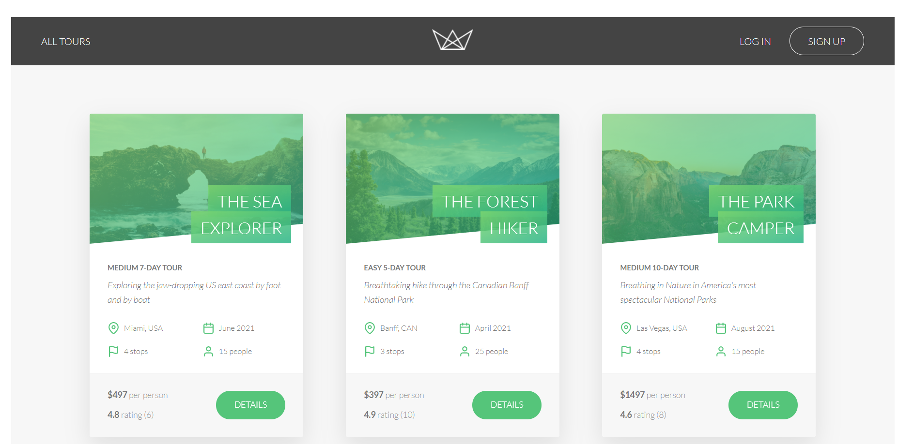

# Travel-Website
## Technologies used in this are: Node js,express,mongodb, pug 

### live version available at  	[Click Here](https://manishapps.herokuapp.com/)

 ### Things which i learned while making this project.
 
 - [x] followed mvc model architecture.
 - [x] Error Handling.
 - [x] Advanced mongoose concepts.
 - [x] server side rendering with pug templates.
 - [x] emails and otp using sendgrid api. 
 - [x] jwt authentication.
 - [x] Advanced authentication and authorization (including password reset).
 - [x] Credit card payments with Stripe. 
 - [x] Security: encryption, sanitization, rate limitinge , etc.
